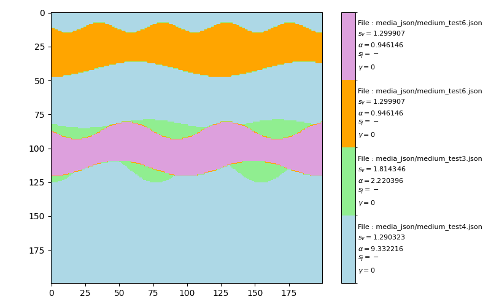
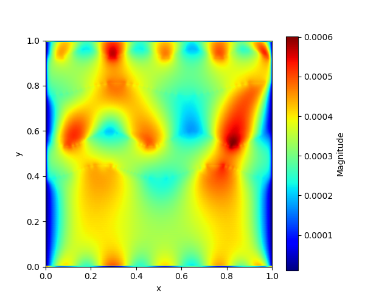

# 🌀 LB-WBS: Lattice Boltzmann for Heterogeneous Porous Media

This project implements a **Lattice Boltzmann (LB-WBS) scheme** for simulating flows in heterogeneous porous media with pressure dependence.

## 📂 Project structure

- `streamlit run Assist_WBS.py`: Streamlit interface to **set up LB-WBS parameters** and **save them into a JSON file** describing the porous medium.  
- `streamlit run Reader_JSON.py`: Streamlit interface to **read and visualize** the content of a JSON file.  
- `LB_WBS.py`: Implementation of the LB-WBS scheme.  
- `PorousMedia.py`: Generation of heterogeneous porous matrices (veins network, blobs, circularn shape, non layers,...).  
- `extractJSON.py`: Reading and extracting parameters from `.json` files.  
- `utils.py`: Utility functions (visualization, parameter handling, etc.).  
- `media_json/`: Directory containing `.json` files describing porous layer properties.  
- `main.py`: Full example script illustrating how to use the LB-WBS scheme.  
- `_JSON_impermeable/`: Scripts to generate JSON files describing **impermeable properties**.  

## ⚙️ Requirements

Install the required dependencies (tested with **Python 3.9**):  

```bash
pip install -r requirements.txt
```

## 🚀 Example run

Run the main script:  

```bash
python main.py
```

This script will:  
1. Generate a porous matrix with multiple layers.  
2. Extract parameters from the `.json` files.  
3. Build the LB-WBS model with pressure dependence.  
4. Run the simulation until convergence.  
5. Display the **velocity magnitude field** with `matplotlib`.  

## 🖥️ Streamlit interfaces

Two graphical interfaces are provided to make the project easier to use:  

### 🔧 Parameter setup and JSON generation
```bash
streamlit run Assist_WBS.py
```
This interface allows you to:  
- Configure the physics parameters of the model and give the LB-WBS scheme parameters.  
- Save them into a **JSON** file describing the porous medium.  

### 📑 JSON reading and visualization
```bash
streamlit run Reader_JSON.py
```
This interface allows you to:  
- Load an existing **JSON** file.  
- Visualize its parameters and associated properties.  

---

## 🧩 Detailed Example

Below is a complete example of running the **LB-WBS scheme** in a heterogeneous porous medium.

```python
import matplotlib.pyplot as plt
import numpy as np
import LB_WBS as LB
import extractJSON
import PorousMedia
import utils

# 📐 Domain size
NX, NY = 200, 200

# 🌊 Initial conditions
UX0, UY0 = 0, 0

# 📂 JSON files describing porous layers
root_file = 'media_json/'
path_json = [
    'medium_test4.json',
    'medium_test3.json',
    'medium_test6.json',
    'medium_test6.json'
]

path_json = [root_file + file_json for file_json in path_json]
number_of_layers = len(path_json)

# 🧱 Step 1: Generate heterogeneous porous medium
porous_media = PorousMedia.generate_layers(
    height=NX, width=NX, num_layers=number_of_layers, seed=33
).T

# 📑 Extract parameters from JSON
multi_porous = extractJSON.multi_model(path_json, view_table=False)
value_gamma = [0] * number_of_layers  # Non-linear term 0 we don't take 1 we take.

# 🔍 Visualization
utils.show_porous_media_and_LB_paramters(porous_media, multi_porous, gamma_value=value_gamma)# <-- first output

# ⚙️ Pre-processing LB-WBS parameters
RHO_OUT = float(multi_porous[0]['adimensionne']['rho_out'])
RHO0 = RHO_OUT
RHO_IN = float(multi_porous[0]['adimensionne']['rho_in'])
LENGTH = float(multi_porous[0]['adimensionne']['L'])
DX = float(multi_porous[0]['adimensionne']['dx'])
DT = float(multi_porous[0]['adimensionne']['dt'])
CS = DX / DT / np.sqrt(3)

# Relaxation times, theta field and gamma_field (depending in space)
XI, THETA_FIELD, GAMMA_FIELD = LB.relaxation_time_matrix(
    NX=NX, NY=NY, DX=DX,
    number_of_layers=number_of_layers,
    multi_porous=multi_porous,
    porous_media=porous_media,
    gamma_value=value_gamma
)

# 🌀 LB-WBS Model
#create the bridge between the porous media (porous matrix) and LB-WBS parameters. 
model = LB.PressureDependanceModel(
    THETA_FIELD=THETA_FIELD,
    GAMMA_FIELD=GAMMA_FIELD,
    XI=XI,
    NX=NX, NY=NY,
    RHO_IN=RHO_IN,
    RHO_OUT=RHO_OUT,
    CS=CS,
)

# 🔄 Initialization
model.initilisation(RHO0=RHO0, UX0=UX0, UY0=UY0)

# 🚧 Boundary conditions
model.right_bc = 'No slip' #or 'Free slip'
model.left_bc = 'No slip' #or 'Free slip' 
# Streaming model 'WBS' or ZM'
model.streaming_model = 'WBS'

# ▶️ Run simulation
model.maximum_of_iteration = 2000 #number of iterations
model.run()

# 📊 Post-processing: velocity magnitude
magnitude = np.sqrt(model.u**2 + model.v**2)
fig, ax = plt.subplots(1, 1, figsize=(6, 5))
im = ax.imshow(magnitude, extent=[0, LENGTH, 0, LENGTH],
               cmap='jet', aspect='equal')
cbar = plt.colorbar(im, ax=ax)
cbar.set_label("Magnitude")
ax.set_xlabel("x")
ax.set_ylabel("y")

plt.show()  # <-- second output
```

---

## 📸 Example Outputs

### 1. Porous medium and LB parameters visualization  
*(after `utils.show_porous_media_and_LB_paramters(...)`)*  



---

### 2. Velocity magnitude field  
*(after the final `plt.show()`)*  



---

## 📖 Citation

If you use this project in your research, please cite it as follows:  

```bibtex
@misc{Coiffard2025LBMultiScale,
  author       = {Coiffard, Théo},
  title        = {LB-MultiScale: Multiscale Lattice Boltzmann Methods for Porous Media},
  year         = {2025},
  howpublished = {\\url{https://github.com/theocoiffard/LB-MultiScale}},
  version      = {0.1.0},
  institution  = {Laboratoire Mathématiques, Image et Applications (MIA), La Rochelle Université, France}
}
```
